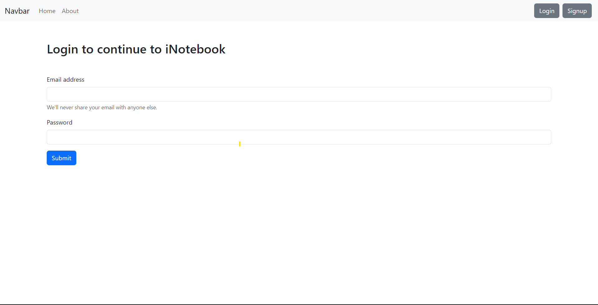

# iNotebook

iNotebook is a React-based project that serves as your digital notebook, allowing you to securely log in, sign up to create an account, manage your notes, and stay organized. With iNotebook, you can easily add, edit, and delete notes, ensuring you never miss important information.

## Features

1. **Log In to an Account**: Users can log in to their accounts using their registered credentials. This feature provides a secure way to access their saved notes and maintain privacy.

2. **Sign Up to Create an Account**: New users can create an account by providing essential information and setting up login credentials. This step is required to start using the iNotebook application.

3. **Logout from the Account**: Users can log out from their accounts, which ensures that their notes and personal information are protected when they are not using the application.

4. **Add a Note**: iNotebook allows users to add new notes, enabling them to jot down their thoughts, reminders, or any other important information conveniently.

5. **Edit a Note**: Users can edit their existing notes, making it easy to update information or correct any mistakes in their entries.

6. **Delete a Note**: This feature enables users to remove notes that are no longer needed or relevant, helping them keep their notebook organized and clutter-free.

## Getting Started

Follow these instructions to set up and run the iNotebook project locally:

1. **Clone the Repository**: Begin by cloning this repository to your local machine using the following command:
```
git clone https://github.com/urvashitech/inotebook.git
```

2. **Install Dependencies**: Navigate to the project directory and install the required dependencies by running the following command:
```cd inotebook
npm install
```

3. **Run the Application**: Once the dependencies are installed, start the React development server using the following command:
```
npm start
```

4. **Access the Application**: Open your web browser and visit `http://localhost:3000` to access the iNotebook application.

## Usage

1. **Create an Account**: If you are a new user, click on the "Sign Up" button to create a new account by providing the necessary information.

2. **Log In**: Once you have an account, use your login credentials to log in to your iNotebook account.

3. **Add a Note**: After logging in, click on the "Add Note" button to create a new note. Enter the note details and click "Save" to store the note in your notebook.

4. **Edit a Note**: To make changes to an existing note, click on the note you wish to edit. The note will be displayed in an editable format. Make the required changes and click "Save" to update the note.

5. **Delete a Note**: If you want to delete a note, click on the "Delete" button associated with the note you wish to remove.

6. **Logout**: To logout from your iNotebook account, click on the "Logout" button.

## Contributing

Contributions to the iNotebook project are always welcome. If you find any issues or have suggestions for improvements, feel free to open a GitHub issue or submit a pull request. Please ensure that any contributions align with the project's coding standards and follow the existing code structure.

## License

The iNotebook project is licensed under the [MIT License](LICENSE). Feel free to use, modify, and distribute the code as per the terms of the license.

## Acknowledgments

- This project was built using React (version X.X.X) and various other open-source libraries, which are listed as dependencies in the `package.json` file.
- Special thanks to the contributors of the libraries and resources used in this project.

## Contact

If you have any questions, suggestions, or feedback, you can reach out to the project maintainer at [urvashikshatriya9@gmail.com]
---
<div style="display: flex;">
  
  
</div>